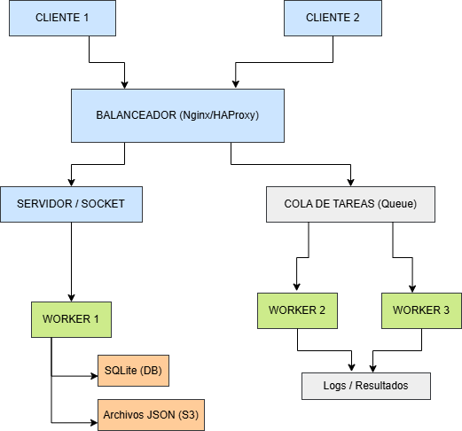

# PFO3_PSRedes_SabrinaChoque_ComisionD

# Alumno: Sabrina Choque

# Comision: D

# Descripcion del PFO3:
En este proyecto implementaremos un sistema distribuido donde múltiples clientes se comunican con un servidor mediante sockets TCP.  
El servidor distribuye las tareas a varios *workers* a través de una cola de mensajes (simulando RabbitMQ).  
Los resultados se almacenan en SQLite y archivos JSON (simulando S3).

# Diagrama del sistema distribuido:

